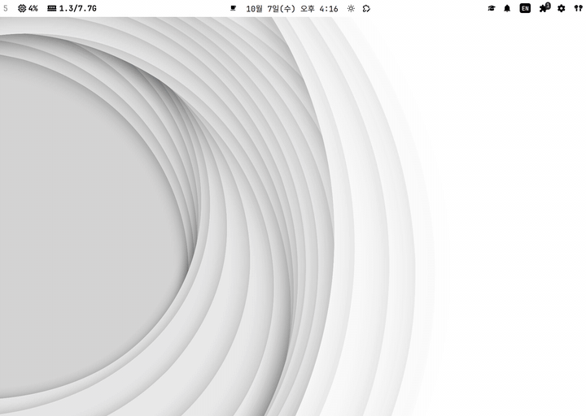

# AI Note Clock (Omarchy)

Apple-style date and time, a monthly calendar, and your AI Note tasks in the Omarchy bar.
Four UI languages: English, Korean, Simplified Chinese, and Traditional Chinese, detected automatically with a Language setting to override it.
Complete or add tasks after signing in; the clock and calendar also work without an account.

```bash
git clone https://github.com/seunghan91/omarchy-ainote-clock.git
cd omarchy-ainote-clock
./install.sh
```

## 소개

Omarchy 상단 바 가운데 시계를 애플식 한국어·영어·중국어(간체·번체) 표기로 바꾸고,
달력 패널에서 AI Note 할일을 보고·완료하고·추가하는 셸 플러그인.



```
10월 7일(수) 오후 1:56
```

- 기본 시계 `omarchy.clock` 자리를 그대로 대체한다(`omarchy.clonedFrom`). 단축키(Super+Ctrl+Alt+D)·IPC 도 따라온다.
- 달력: 4개 언어 요일, 일요일 빨강·토요일 파랑, 날짜별 할일 점(밀린 할일은 빨간 점).
- 할일: 오늘을 고르면 `전체 · 오늘 · 밀린` 필터, 밀린 할일은 접고 펼친다. 체크로 완료, 입력칸에 쓰고 Enter 로 추가.
- 로그인: 패널의 「AI Note 로그인」 → 브라우저에서 코드 승인(AI Note 기기 인증). 할일 API 토큰과 MCP 키를 함께 받는다.

## 설치

```bash
git clone https://github.com/seunghan91/omarchy-ainote-clock.git
cd omarchy-ainote-clock
./install.sh                     # 기본 시계를 대체
./install.sh --uninstall         # 기본 시계로 복귀
./install.sh --uninstall --purge # + 로그아웃·자격 증명 삭제
```

화면이 잠긴 상태에서는 설치하지 않는다(잠금 화면도 셸이다).

## Languages / 지원 언어

| Language | Setting value | Bar example | How auto picks it |
|---|---|---|---|
| English | `en` | `Wed Oct 7 1:56 PM` | Fallback when no Korean or Chinese locale matches |
| 한국어 | `ko` | `10월 7일(수) 오후 1:56` | Locale name or any UI-language tag starts with `ko` |
| 简体中文 | `zh-Hans` | `10月7日 周三 下午1:56` | Other tags starting with `zh`, such as `zh_CN` or `zh-Hans` |
| 繁體中文 | `zh-Hant` | `10月7日 週三 下午1:56` | `zh_TW`, `zh_HK`, `zh_MO`, or any tag containing `Hant` |

`language=auto` (default) checks `Qt.locale().name` and `uiLanguages`, case-insensitively, accepting hyphen or underscore locale separators.
Korean matches keep their existing priority. Otherwise, a Chinese locale name takes precedence; if it does not match, the first matching UI-language tag is used. Everything else uses English.
Explicit settings override detection; invalid values behave as `auto`.
The settings group shows Auto in the current UI language (`Auto` / `자동` / `自动` / `自動`) and each language in its own name.

Translations other than Korean/English have not been reviewed by a native speaker yet.

## 설정

패널 아래 「설정」에서 고르거나 터미널에서 바꾼다.

`language=auto`는 위 표의 규칙으로 한국어·영어·중국어(간체·번체)를 고른다. 시스템 로캘이 `en_US`이고 UI 언어 목록에도 한국어·중국어가 없으면 영어가 선택되므로, 한국어를 쓰려면 「Language → 한국어」 또는 `language=ko`로 바꾼다. 잘못된 설정값은 `auto`로 처리한다.

| 키 | 값 | 기본 |
|---|---|---|
| `language` | `auto` · `en` · `ko` · `zh-Hans` · `zh-Hant` | `auto` |
| `taskIndicator` | `none` · `split`(할일 N · 밀림 N) · `total`(합계) | `none` |
| `panelLayout` | `vertical` · `horizontal` | `vertical` |
| `weekStart` | `sunday` · `monday` | `sunday` |

```bash
omarchy bar set io.github.seunghan91.ainote-clock taskIndicator split
```

## 구조

| 파일 | 역할 |
|---|---|
| `bin/ainote-clock` | 자격 증명과 HTTP 를 다루는 유일한 프로세스(bash·curl·jq). 한 줄 JSON 출력 |
| `TaskStore.qml` | helper 호출, 월별 캐시, 5분 갱신 |
| `BarWidget.qml` · `Panel.qml` · `ClockText.js` | 바 라벨, 달력·할일·설정 화면, 4개 언어 문구와 날짜 |
| `install.sh` | 설치·원복(가운데 고정 `bar.centerAnchor` 포함) |

자격 증명은 `~/.config/ainote-clock/credentials.json`(0600)에만 있다. 토큰은 프로세스 인자·로그·shell.json 에 남지 않는다.
에이전트는 같은 로그인으로 MCP 를 쓸 수 있다.

```bash
echo '{"action":"tasks","due_today":true}' | bin/ainote-clock mcp-call tasks_read
```

## 테스트

```bash
TZ=Asia/Seoul bash tests/helper/run.sh   # helper, 로컬 가짜 서버(실서버 응답 형식 반영)
node tests/kodate.test.mjs               # 날짜 표기
bash tests/normalize.test.sh             # 마감일 날짜 분류
```

## 크레딧

달력 패널 구조는 Omarchy 기본 시계(`shell/plugins/panels/clock`, MIT)를 바탕으로 했다.
